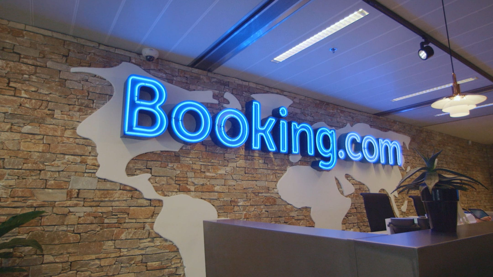
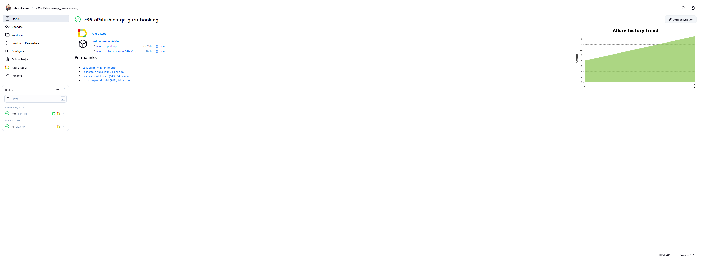
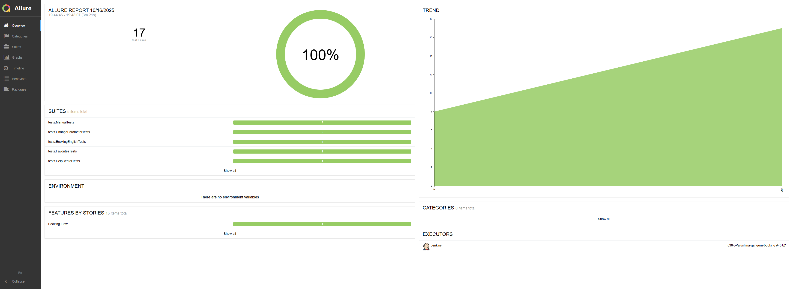
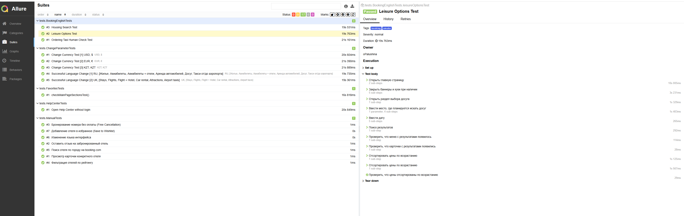
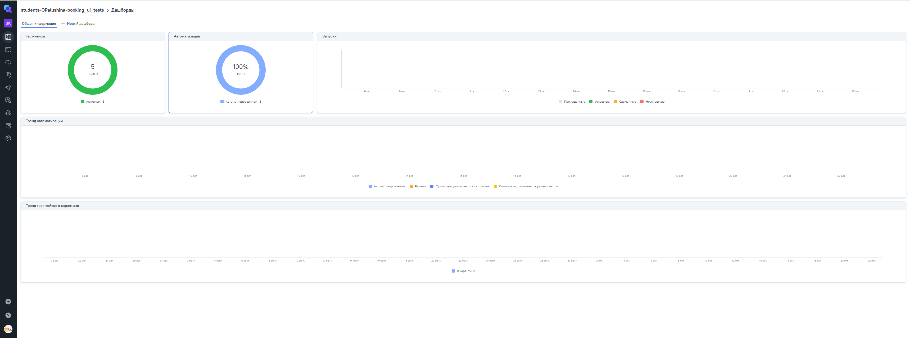
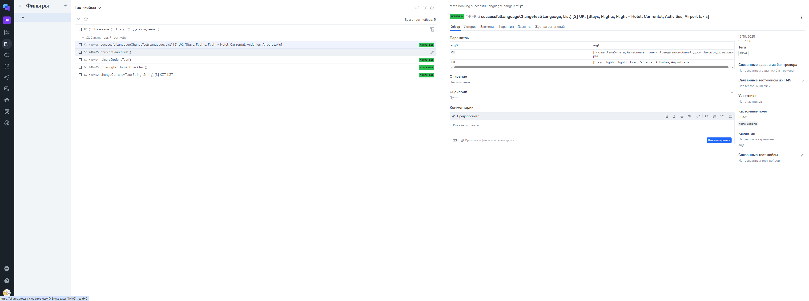
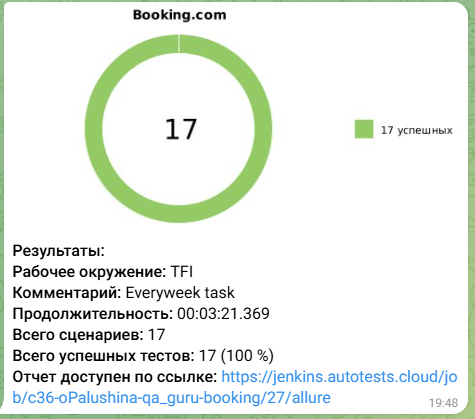
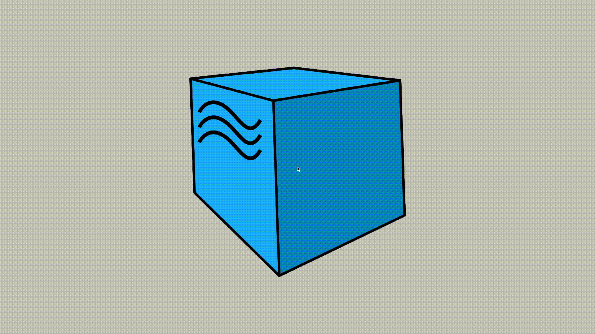

# Проект по автоматизации тестовых сценариев для сайта [Booking.com](https://www.booking.com/)
<a href="https://www.booking.com/" target="_blank">
    
</a>

<h2 id="содержание">📜 Содержание:</h2>

- [Используемый стек](#computer-используемый-стек)
- [Локальный запуск тестов](#локальный-запуск-тестов)
- [Удаленный запуск тестов](#удаленный-запуск-тестов)
- [Установленная конфигурация](#установленная-конфигурация)
- [Интеграция с Jenkins](#интеграция-с-jenkins)
- [Интеграция с Allure](#интеграция-с-allure)
- [Интеграция с Allure Testops](#интеграция-с-allure-testops)
- [Уведомления в Telegram](#уведомления-telegram)
- [Видео пример запуска тестов в Selenoid](#видео-пример)

## :computer: Используемый стек

<p align="center">
<a href="https://www.jetbrains.com/idea/" target="_blank">
    
</a>
<a href="https://www.java.com/" target="_blank">
    
</a>
<a href="https://selenide.org/" target="_blank">
    
</a>
<a href="https://selenoid.autotests.cloud/" target="_blank">
    
</a>
<a href="https://allurereport.org/" target="_blank">
    
</a>
<a href="https://qameta.io/" target="_blank">
    
</a>
<a href="https://gradle.org/" target="_blank">
    
</a>
<a href="https://junit.org/junit5/" target="_blank">
    
</a>
<a href="https://github.com/" target="_blank">
    
</a>
<a href="https://www.jenkins.io/" target="_blank">
    
</a>
<a href="https://telegram.org/" target="_blank">
    
</a>
</p>

Тесты в данном проекте написаны на языке <code>Java</code>, сборщик - <code>Gradle</code>. Так же были использованы фреймворки <code>JUnit 5</code> и [Selenide](https://selenide.org/).
При прогоне тестов браузер запускается не локально, а в [Selenoid](https://aerokube.com/selenoid/).
Для удаленного запуска реализована джоба в <code>Jenkins</code> с формированием Allure-отчета и отправкой результатов в <code>Telegram</code> при помощи бота.

Содержание Allure-отчета:
* Шаги теста;
* Скриншот страницы на последнем шаге;
* Page Source;
* Логи браузерной консоли;
* Видео выполнения автотеста.

[Вернуться к оглавлению⬆️](#содержание) 

## :arrow_forward: Запуск автотестов

### Локальный запуск тестов
```
./gradlew clean test -Denv=local
```
При выполнении данной команды в терминале IDE тесты запустятся локально в браузере Chrome.

<code>clean</code> — удаляет каталог build/ в проекте (все скомпилированные классы, отчёты, кэш тестов, временные файлы);

<code>-Denv</code> — переменная, которая принимает значения <code>local</code> (локальный запуск) и <code>remote</code> (удаленный запуск);

<code>test</code> — запускает задачу тестирования Gradle, которая:

- компилирует тесты и основной код;
- запускает тесты (JUnit, TestNG и т.д.);
- формирует отчёты (например, `build/reports/tests/test/index.html`).

[Вернуться к оглавлению⬆️](#содержание)

### Удаленный запуск тестов

Запуск с настройками из remote.properties:
```
./gradlew clean test clean test -Denv=remote
```
Команда для запуска из Jenkins (параметрами можно управлять):
```
./gradlew clean test clean test -Denv=remote -Dbrowser=${BROWSER} -DbrowserVersion=${BROWSER_VERSION} -DbrowserSize=${BROWSER_SIZE} -DremoteWebDriverUrl=${REMOTE} -DbaseUrl=${URL}
```
где
- <code>Dbrowser</code> - название браузера. Доступны опции chrome/opera/firefox;
- <code>DbrowserVersion</code> - версия браузера. Для chrome - 127.0 / 128.0; для firefox = 124.0 / 125.0;
- <code>DbrowserSize</code> - размер окна браузера. До дефолту 1920x1080;
- <code>DremoteWebDriverUrl</code> - адрес удаленного веб-драйвера;
- <code>DbaseUrl</code> - базовый урл, на котором будут запускаться автотесты.

[Вернуться к оглавлению⬆️](#содержание)

### Установленная конфигурация

* Браузер - <code>chrome</code>;
* Версия браузера - <code>128.0</code>;
* Расширение окна браузера - <code>1920x1080</code>;
* Базовый URL - <code>https://www.booking.com</code>.

[Вернуться к оглавлению⬆️](#содержание)

<a id="интеграция-с-jenkins"></a>
##  [Интеграция с Jenkins](https://jenkins.autotests.cloud/view/QA.GURU%20students/job/c36-oPalushina-qa_guru-booking/48/)
<p align="center">
    
</p>

[Вернуться к оглавлению⬆️](#содержание)

<a id="интеграция-с-allure"></a>
##  [Интеграция с Allure](https://jenkins.autotests.cloud/job/c36-oPalushina-qa_guru-booking/48/allure/#)
<p align="center">
    
</p>

[Результат успешного прогона](https://jenkins.autotests.cloud/job/c36-oPalushina-qa_guru-booking/48/allure/#)
<p align="center">

</p>

[Вернуться к оглавлению⬆️](#содержание)

<a id="интеграция-с-allure-testops"></a>
##  [Интеграция с Allure Test Ops](https://allure.autotests.cloud/project/4948/dashboards)

<p align="center">
<a href="https://allure.autotests.cloud/project/4948/dashboards" target="_blank">
    
</a>
</p>

[Allure Test Ops тест-кейсы](https://allure.autotests.cloud/project/4948/dashboards)
<p align="center">
<a href="https://allure.autotests.cloud/project/4948/test-cases?treeId=0" target="_blank">
    
</a>
</p>

[Вернуться к оглавлению⬆️](#-содержание)

<a id="уведомления-telegram"></a>
###  Уведомления в Telegram с использованием бота

После завершения сборки специальный бот, созданный в <code>Telegram</code>, автоматически обрабатывает и отправляет сообщение с результатом.

<p align="center">

</p>

[Вернуться к оглавлению⬆️](#содержание)

<a id="видео-пример"></a>
###  Видео пример запуска тестов в Selenoid

К каждому тесту в отчете прилагается видео прогона.
<p align="center">
  
</p>

[Вернуться к оглавлению⬆️](#содержание) 
