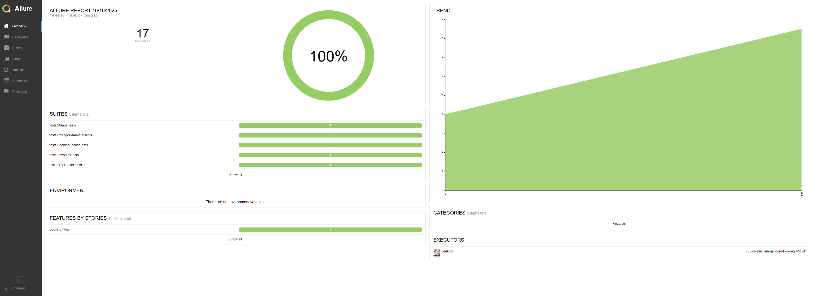
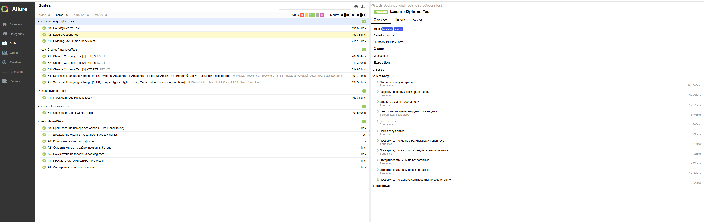

# Проект по автоматизации тестовых сценариев для сайта Booking.com
## :scroll: Содержание:

- [Используемый стек](#computer-используемый-стек)
- [Запуск автотестов](#arrow_forward-запуск-автотестов)
- [Сборка в Jenkins](#-сборка-в-jenkins)
- [Пример Allure-отчета](#-пример-allure-отчета)
- [Результат успешного прогона](#-результат-успешного-прогона)
- [Уведомления в Telegram](#-уведомления-в-telegram-с-использованием-бота)
- [Видео примера запуска тестов в Selenoid](#-видео-пример-запуска-тестов-в-Selenoid)

## :computer: Используемый стек

<p align="center">
<a href="https://www.jetbrains.com/idea/" target="_blank">
    
</a>
<a href="https://www.java.com/" target="_blank">
    
</a>
<a href="https://selenide.org/" target="_blank">
    
</a>
<a href="https://selenoid.autotests.cloud/" target="_blank">
    
</a>
<a href="https://allurereport.org/" target="_blank">
    
</a>
<a href="https://gradle.org/" target="_blank">
    
</a>
<a href="https://junit.org/junit5/" target="_blank">
    
</a>
<a href="https://github.com/" target="_blank">
    
</a>
<a href="https://www.jenkins.io/" target="_blank">
    
</a>
<a href="https://telegram.org/" target="_blank">
    
</a>
</p>

Тесты в данном проекте написаны на языке <code>Java</code>, сборщик - <code>Gradle</code>. Так же были использованы фреймворки <code>JUnit 5</code> и [Selenide](https://selenide.org/).
При прогоне тестов браузер запускается не локально, а в [Selenoid](https://aerokube.com/selenoid/).
Для удаленного запуска реализована джоба в <code>Jenkins</code> с формированием Allure-отчета и отправкой результатов в <code>Telegram</code> при помощи бота.

Содержание Allure-отчета:
* Шаги теста;
* Скриншот страницы на последнем шаге;
* Page Source;
* Логи браузерной консоли;
* Видео выполнения автотеста.

## :arrow_forward: Запуск автотестов

### Запуск тестов из терминала
```
./gradlew clean test
```
При выполнении данной команды в терминале IDE тесты запустятся удаленно в <code>Selenoid</code>.

<code>clean</code> — удаляет каталог build/ в проекте (все скомпилированные классы, отчёты, кэш тестов, временные файлы);

<code>test</code> — запускает задачу тестирования Gradle, которая:

- компилирует тесты и основной код;
- запускает тесты (JUnit, TestNG и т.д.);
- формирует отчёты (например, `build/reports/tests/test/index.html`).

### Установленная конфигурация

* Браузер - <code>chrome</code>;
* Версия браузера - <code>127.0</code>;
* Расширение окна браузера - <code>1920x1080</code>.


##  Сборка в Jenkins
[Сборка в Jenkins](https://jenkins.autotests.cloud/view/QA.GURU%20students/job/c36-oPalushina-qa_guru-booking/1/)
<p align="center">
    
</p>

##  Пример Allure-отчета
### Overview
[Allure  отчет](https://jenkins.autotests.cloud/view/QA.GURU%20students/job/c36-oPalushina-qa_guru-booking/1/allure/)
<p align="center">
    
</p>

##  Результат успешного прогона
### Overview

<p align="center">

</p>

###  Уведомления в Telegram с использованием бота

После завершения сборки специальный бот, созданный в <code>Telegram</code>, автоматически обрабатывает и отправляет сообщение с результатом.

<p align="center">

</p>

###  Видео пример запуска тестов в Selenoid

К каждому тесту в отчете прилагается видео прогона.
<p align="center">
  
</p>
